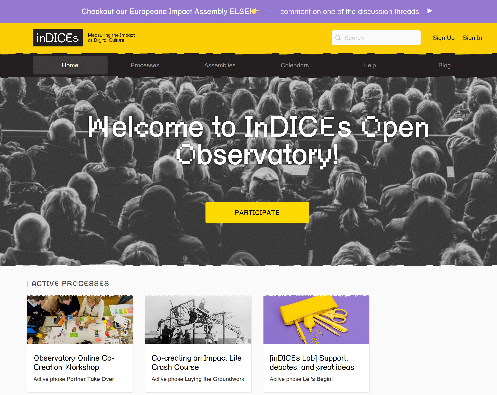

# Indices Decidim

Free Open-Source participatory democracy, citizen participation and open government for cities and organizations

This is the open-source repository for [Indices Participatory Platform](https://participate.indices-culture.eu/), based on [Decidim](https://github.com/decidim/decidim).

This Application is being developed in the context of the inDICEs project which has received funding from the European Union’s Horizon 2020 research and innovation programme under grant agreement No 870792

  
  

